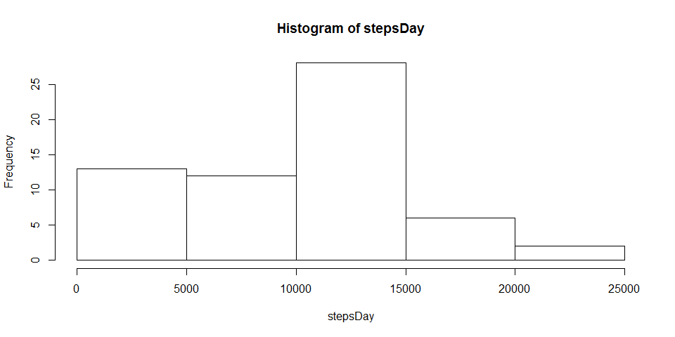
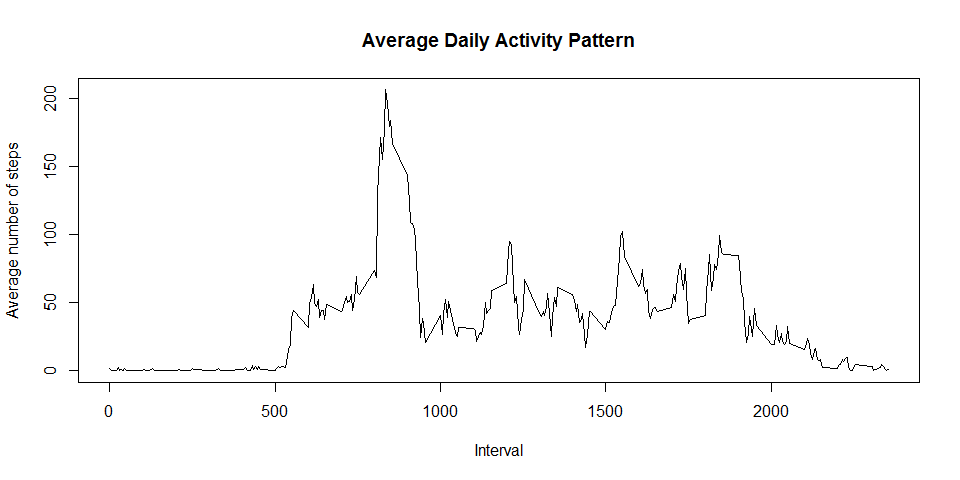
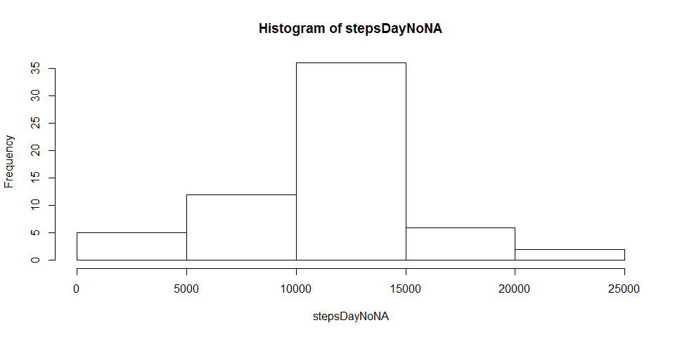
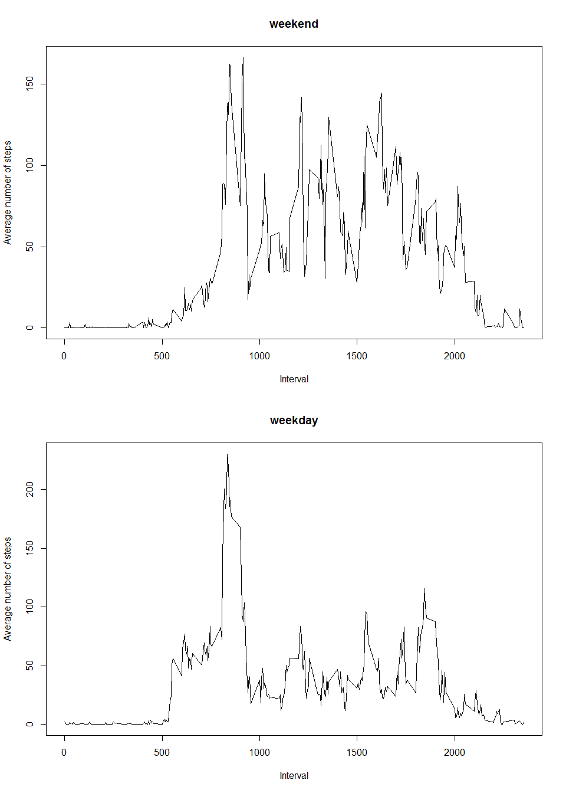

# Reproducible Research: Peer Assessment 1


## Loading and preprocessing the data
First we will load the dataset


```r
data <- read.csv("activity/activity.csv")
```


## What is mean total number of steps taken per day?
We will create a vector containing the total number of steps taken each 
day (ignoring any missing values), and then make a histogram of this vector.

```r
stepsDay <- tapply(data$steps, data$date, 
                    function(x) sum(x, na.rm = T))

hist(stepsDay)
```

 


Now we will calculate the average number of steps taken in a day

```r
mean(stepsDay)
```

```
## [1] 9354.23
```
and the median

```r
median(stepsDay)
```

```
## [1] 10395
```


## What is the average daily activity pattern?
First we will create a vector containing the number of steps taken during each
interval of time, averaged across all days (ignoring any missing values).

```r
meanStepsInt <- tapply(data$steps, data$interval, 
                         function(x) mean(x, na.rm = T))
```


Now we will plot the data, with the intervals on the x-axis, and the average 
number of steps taken on the y-axis.

```r
plot(unique(data$interval), meanStepsInt, type = "l", 
     xlab = "Interval", ylab = "Average number of steps",
     main = "Average Daily Activity Pattern")
```

 


The 5-minute interval, which contains, on average, the maximum number of steps
is given by:

```r
as.numeric(names(meanStepsInt[meanStepsInt == max(meanStepsInt)]))
```

```
## [1] 835
```


## Imputing missing values
The presence of missing values in the data can introduce biases into the
analysis, so we will atempt to rectify this problem. 

First, in order to get a sense of how much of an effect the missing values have
on the data, we must compute the number of missing values in the dataset 
like this:

```r
sum(is.na(data$steps))
```

```
## [1] 2304
```


Now in order to remove the missing values whilst maintaining the data's
integrity, we create a copy of the original dataset replacing all the missing 
values with the number of steps taken during that interval averaged across all 
days.

```r
dataNoNA <- data

for(i in seq_along(dataNoNA$steps)){
      if(is.na(dataNoNA$steps[i])){
            dataNoNA$steps[i] <- 
                  meanStepsInt[as.character(dataNoNA$interval[i])]
      }
}
```


Just like before, we will create a vector containing the total number of steps 
taken each day, and then make a histogram of this vector

```r
stepsDayNoNA <- tapply(dataNoNA$steps, dataNoNA$date, sum)

hist(stepsDayNoNA)
```

 


Now we will calculate the average number of steps taken in a day

```r
mean(stepsDayNoNA)
```

```
## [1] 10766.19
```
and the median

```r
median(stepsDayNoNA)
```

```
## [1] 10766.19
```


## Are there differences in activity patterns between weekdays and weekends?
To answer this question we must first create a function which will classify a
a given day as a "weekday" or a "weekend".

```r
GetDayType <- function(x){
      if(x == "Sunday" || x == "Saturday"){
            "weekend"
      } else {
            "weekday"
      }
}
```


Now we will create a factor variable in the dataset with two levels: "weekday" 
and "weekend". We will then create two new data frames by separating the rows of
the dataset by the type of day it is.

```r
dataNoNA$dayType <- factor(sapply(weekdays(as.Date(data$date)), GetDayType))
weekday <- dataNoNA[dataNoNA$dayType == "weekday",]
weekend <- dataNoNA[dataNoNA$dayType == "weekend",]
```


Before we make some plots, we will first create vectors containing the number of
steps taken during each interval averaged across all weekdays or weekends.

```r
meanStepsWeekend <- tapply(weekend$steps, weekend$interval, mean)
meanStepsWeekday <- tapply(weekday$steps, weekday$interval, mean)
```


Finally we will make two plots, like before, with the intervals on the x-axis, 
and the average number of steps taken on the y-axis.

```r
par(mfrow=c(2,1))
plot(unique(weekend$interval), meanStepsWeekend, type = "l",
     xlab = "Interval", ylab = "Average number of steps", main = "weekend")
plot(unique(weekday$interval), meanStepsWeekday, type = "l",
     xlab = "Interval", ylab = "Average number of steps", main = "weekday")
```

 
